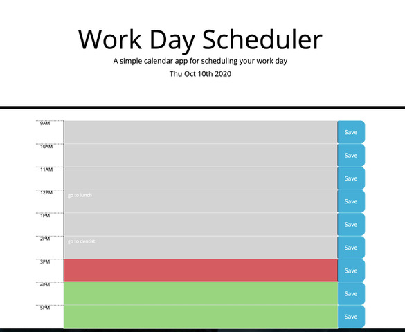

# work-day-planner

**Description**

This is a daily planner created to give busy workers a way to manage their day.

**Installation**

Click on the settings tab.
Scroll down to the section that says GitHub Pages.
Click on the link in the green box next to "your site is published at".

Or you can just click here: https://dnfrancis22.github.io/work-day-planner/

**Usage**

When the page loads you see the header Work day scheduler. You can also see the current date.
Below the header you will see the time blocks. They are color coded depending on the hour. Green blocks represent the future. The red block represents the current hour. The grey blocks are the past. That's the part of the day that you don't have to worry about anymore.

You can enter notes into the blocks. Hit the save button and the notes will stay even if you refresh the page or close and reopen the browser.

**License**

MIT License

Copyright (c) [2020] [Dennis Francis]

Permission is hereby granted, free of charge, to any person obtaining a copy
of this software and associated documentation files (the "Software"), to deal
in the Software without restriction, including without limitation the rights
to use, copy, modify, merge, publish, distribute, sublicense, and/or sell
copies of the Software, and to permit persons to whom the Software is
furnished to do so, subject to the following conditions:

The above copyright notice and this permission notice shall be included in all
copies or substantial portions of the Software.

THE SOFTWARE IS PROVIDED "AS IS", WITHOUT WARRANTY OF ANY KIND, EXPRESS OR
IMPLIED, INCLUDING BUT NOT LIMITED TO THE WARRANTIES OF MERCHANTABILITY,
FITNESS FOR A PARTICULAR PURPOSE AND NONINFRINGEMENT. IN NO EVENT SHALL THE
AUTHORS OR COPYRIGHT HOLDERS BE LIABLE FOR ANY CLAIM, DAMAGES OR OTHER
LIABILITY, WHETHER IN AN ACTION OF CONTRACT, TORT OR OTHERWISE, ARISING FROM,
OUT OF OR IN CONNECTION WITH THE SOFTWARE OR THE USE OR OTHER DEALINGS IN THE
SOFTWARE.
